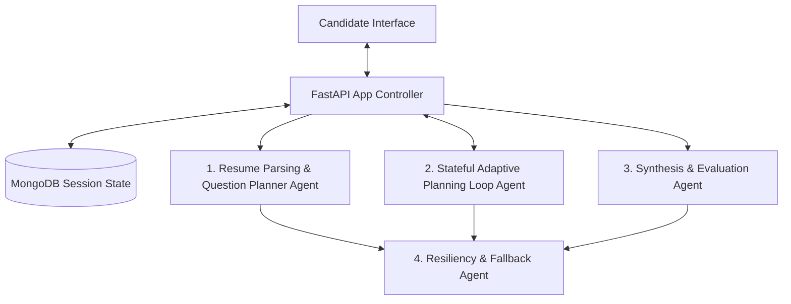

# Interviq — Agentic AI Multi-Agent Mock Interview Simulator

Interviq is a state-of-the-art, end-to-end **Agentic AI Mock Interview Simulator** designed to help developers and professionals practice mock interviews. Powered by a specialized, collaborative **Multi-Agent architecture**, the platform dynamically reads candidates' resumes, generates customized role-specific questions, guides users through a realistic three-stage interview (MCQ, Live Coding Sandbox, and Speech-to-Text Verbal Questions), and provides comprehensive AI-driven evaluations and PDF scorecards.

---

## 🤖 Agentic AI & Multi-Agent Architecture

Unlike static interview scripts, Interviq leverages a stateful, adaptive **Multi-Agent Orchestrator** powered by Groq API Llama models. Each agent acts as an autonomous node with specialized prompts, system roles, and decision logic, collaborating through a central state manager to provide a responsive, conversational hiring simulation.



### The Multi-Agent System in Detail:

1. **Resume Parsing & Question Planner Agent** (`resume_parser.py` & `ai_service.py`):
   * **Role**: Analyzes the candidate's uploaded PDF or text resume.
   * **Capabilities**: Parses skills, core technologies, seniority, and employment history.
   * **Decision Logic**: Dynamically plans a custom interview curriculum:
     * Generates **8 target-specific MCQs** (covering concepts matching the resume).
     * Automatically picks **2 tailored coding challenges** from the Problem Bank (calibrated for the candidate's experience level).
     * Devises an **initial technical question** to start the verbal phase.

2. **Stateful Adaptive Evaluator & Planning Agent** (`ai_service.py`):
   * **Role**: The core interviewer guiding the verbal video phase.
   * **State Management**: Performs real-time feedback loops over 6 conversational questions.
   * **Feedback & Adaptation Logic**:
     * **Grading Sub-Agent**: Scores the verbal speech-to-text response (0-10) based on depth, relevance, and accuracy.
     * **Planning Sub-Agent**: Evaluates the score and dynamically shifts the interview difficulty. If a candidate aces a question ($\ge 8$), it increases difficulty (Easy ➔ Medium ➔ Hard) or pivots to advanced topics. If they struggle ($< 5$), it scales down or shifts to simpler fundamentals.
     * **Interviewer Tone**: Generates a warm, spoken transition in the interviewer's voice, bridging the last response and the new question.
     * **Final Phase Shift**: On question #5, the Planning Agent automatically transitions the candidate to behavioral/situational topics for the final question.

3. **Synthesis & Evaluation Agent** (`ai_service.py`):
   * **Role**: The lead scoring panelist.
   * **Capabilities**: Aggregates test performance metrics across all stages: MCQ correct answers, test suite execution results from the coding sandbox, and video verbal transcripts.
   * **Output**: Generates a comprehensive feedback report containing overall rating, skill-specific scores, qualitative feedback (strengths/improvements), recommendations, and a detailed development roadmap.

4. **Resiliency & Fallback Agent** (`ai_service.py`):
   * **Role**: Pipeline health sentinel.
   * **Capabilities**: Intercepts HTTP/API communications. If the primary high-capacity model (`llama-3.3-70b-versatile`) hits rate limits (HTTP 429) or times out, it seamlessly fails over to the faster `llama-3.1-8b-instant` to ensure the candidate's interview session is never interrupted.

---

## 🚀 Key Features

* **📄 Resume-Aware Adaptive Setup**: Extracts experience, skills, and background details from uploaded PDFs or plain text resumes to generate target-specific questions.
* **📝 Stage 1: MCQ Assessment**: Evaluates baseline technical and conceptual knowledge with 5 custom multiple-choice questions.
* **💻 Stage 2: Coding Sandbox**: Runs real code execution checks against a curated problem bank with auto-indent support (Python colon detection).
* **🎥 Stage 3: Video Verbal Interview**: Conducts behavioral and conversational questions. Uses local microphone speech-to-text transcription to capture responses.
* **🤖 Stateful Adaptive Interview Agent**: Dynamically adjusts follow-up questions and difficulty (Easy ➔ Medium ➔ Hard) in real time depending on the candidate's scores.
* **📊 Comprehensive Evaluation Scorecard**: Summarizes category marks (relevance, clarity, depth), highlights strengths/weaknesses, and provides actionable recommendations.
* **📥 Direct PDF Scorecard Export**: Direct client-side PDF downloads utilizing `html2pdf.js` for clean paper/recruiter sharing.
* **🔗 Public Report Access**: Generates public, unauthenticated links (`public=true`) allowing users to easily share their scorecards.
* **✉️ Automatic Email Dispatch**: Sends a summary scorecard directly to the candidate's inbox using SMTP or Brevo integration.
* **🌓 Global Theme Toggle**: Responsive manual toggle button that lets users switch between light and dark theme mode, saving preferences locally.

---

## 🛠️ Technology Stack

* **Frontend**: HTML5 (Semantic Layout), Vanilla CSS3 (3D Glassmorphism, animations), Vanilla JS (ES6 Modules, asynchronous fetch API), and `html2pdf.js` for document printing.
* **Backend**: FastAPI (Python 3.11) providing highly performant REST APIs and hosting static frontend routes.
* **Database**: MongoDB (via `pymongo` client) storing user sessions, resumes, and interview documents.
* **AI Engine**: Groq Cloud API running `llama-3.3-70b-versatile` with an automatic retry failover to `llama-3.1-8b-instant` if rate limits are exceeded.
* **Email Mailers**: Built-in support for SMTP and Brevo HTTP APIs.

---

## 📂 Project Directory Structure

```text
Interviq/
├── backend/
│   ├── config/
│   │   ├── constants.py
│   │   ├── db.py
│   │   └── utils.py
│   │
│   ├── routes/
│   │   ├── auth.py
│   │   ├── interview.py
│   │   ├── resume.py
│   │   └── user.py
│   │
│   ├── services/
│   │   ├── ai_service.py
│   │   ├── email_service.py
│   │   ├── problem_bank.py
│   │   ├── resume_parser.py
│   │   └── token_service.py
│   │
│   └── server.py
│
├── frontend/
│   ├── css/
│   │   ├── 3d-effects.css
│   │   ├── animations.css
│   │   ├── auth.css
│   │   ├── base.css
│   │   ├── components.css
│   │   ├── dashboard.css
│   │   └── interview.css
│   │
│   ├── js/
│   │   ├── api.js
│   │   ├── auth.js
│   │   ├── dashboard.js
│   │   ├── interview.js
│   │   ├── report.js
│   │   ├── theme.js
│   │   ├── utils.js
│   │   └── video-interview.js
│   │
│   ├── pages/
│   │   ├── dashboard.html
│   │   ├── forgot_password.html
│   │   ├── history.html
│   │   ├── index.html
│   │   ├── interview.html
│   │   ├── login.html
│   │   ├── profile.html
│   │   ├── report.html
│   │   ├── reset_password.html
│   │   ├── signup.html
│   │   ├── verify.html
│   │   └── video-interview.html
│   │
│   └── public/
│       ├── logo.png
│       └── logo_backup.jpeg
│
├── .env
├── .gitignore
├── app.py
├── dir_structure
├── Dockerfile
├── docker-compose.yml
├── README.md
└── requirements.txt
```

---

## 💻 Local Developer Setup

### 1. Prerequisites
* Python 3.11.x
* MongoDB Community Server (running locally on `mongodb://localhost:27017`)
* Git

### 2. Installation
Clone the repository:
```bash
git clone https://github.com/dileepmedhuru/Interviq---AI-Interview-Agent.git
cd Interviq
```

Create and activate a virtual environment:
* **Windows**:
  ```powershell
  python -m venv venv
  .\venv\Scripts\activate
  ```
* **macOS / Linux**:
  ```bash
  python3 -m venv venv
  source venv/bin/activate
  ```

Install backend dependencies:
```bash
pip install -r requirements.txt
```

### 3. Environment Variables Setup
Duplicate `.env.example` to `.env` and configure your credentials:
```bash
cp .env.example .env
```

Key environment properties checklist:
```env
PORT=5000
MONGO_URI=mongodb://localhost:27017/ai-interview-agent
JWT_SECRET=your_jwt_secret_string
JWT_REFRESH_SECRET=your_jwt_refresh_secret_string
GROQ_API_KEY=gsk_xxxxxxxxxxxxxxxxxxxxxxxx
EMAIL_USER=your_email@gmail.com
EMAIL_PASS=your_email_app_password
```

### 4. Running the App
Start the unified FastAPI server:
```bash
python app.py
```
Open your browser and navigate to: **`http://localhost:5000`**

---

## ☁️ Deployment (Render + MongoDB Atlas)

### 1. Database Setup
1. Create a free **M0 cluster** on [MongoDB Atlas](https://www.mongodb.com/products/platform/atlas-database).
2. Configure database user access and whitelist IP access from anywhere (`0.0.0.0/0`).
3. Copy your MongoDB connection string: `mongodb+srv://<username>:<password>@cluster.mongodb.net/...`

### 2. Render Web Service Deployment
1. Log in to [Render](https://render.com/) and create a new **Web Service** linked to your GitHub repository.
2. Configure settings:
   * **Language**: `Python`
   * **Build Command**: `pip install -r requirements.txt`
   * **Start Command**: `uvicorn backend.server:app --host 0.0.0.0 --port $PORT`
   * **Instance Type**: `Free`
3. Add your environment keys inside the **Environment** tab:
   * `MONGO_URI` (Atlas connection string)
   * `GROQ_API_KEY` (Groq API Key)
   * `JWT_SECRET` & `JWT_REFRESH_SECRET`
   * `FRONTEND_URL` (Your Render app URL, e.g. `https://interviq.onrender.com`)
   * `EMAIL_USER` / `EMAIL_PASS` (Or setup `BREVO_API_KEY` to bypass SMTP blocks)

Save changes and your application will deploy and go live!
